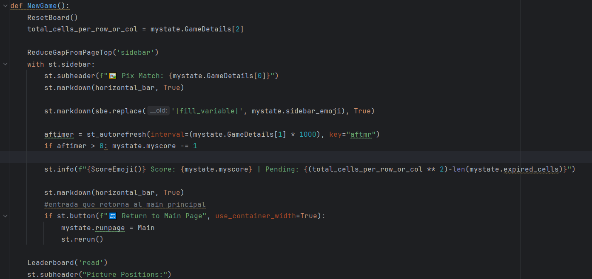

# Requistos vs código
## Requisitos Funcionales y Criterios de Aceptación

| Requisito y Criterios de Aceptación                                                                                                                                                                                                                                                                                                                                                                                                                                                                          | Código/Imagen                                                                                                     |
|--------------------------------------------------------------------------------------------------------------------------------------------------------------------------------------------------------------------------------------------------------------------------------------------------------------------------------------------------------------------------------------------------------------------------------------------------------------------------------------------------------------|-------------------------------------------------------------------------------------------------------------------|
| **1. Configuración de Nivel de Dificultad** **Requisito:** El sistema debe permitir a los jugadores seleccionar el nivel de dificultad antes de comenzar el juego. **Criterios de Aceptación:** - Opciones de dificultad fácil, medio y difícil disponibles para selección. - La configuración de dificultad debe influir en la mecánica del juego, como la frecuencia de regeneración de imágenes y la puntuación. - Tiempos de regeneración específicos:   - Fácil: cada 8 segundos.   - Medio: cada 6 segundos.   - Difícil: cada 5 segundos. |                                                                                            |
| **2. Inicialización del Tablero** **Requisito:** Al comenzar un juego, el sistema debe inicializar el tablero con un conjunto aleatorio de imágenes basado en la dificultad seleccionada. **Criterios de Aceptación:** - El tablero debe ser llenado con imágenes de emojis que corresponden a la dificultad elegida. - Ninguna imagen objetivo (emoji de la barra lateral) debe aparecer más de una vez en el tablero inicial. - La imagen objetivo debe ser seleccionada aleatoriamente y mostrada en la barra lateral. |                                                             |
| **3. Parametrización del Nombre del Jugador y País** **Requisito:** El sistema debe permitir a los jugadores ingresar su nombre y país antes de comenzar el juego. **Criterios de Aceptación:** - Debe existir un campo de texto para que los jugadores ingresen su nombre y país. - Es posible que los campos de nombre y país estén vacíos, pero en ese caso no se muestra el _Leaderboard_ - La información del jugador debe persistir durante la sesión de juego.                         |                                                                                        |
| **4. Mecánica de Juego: Selección de Imágenes** **Requisito:** Los jugadores deben poder seleccionar imágenes en el tablero para obtener puntos. **Criterios de Aceptación:** - Al hacer clic en una imagen, el sistema debe verificar si es la imagen objetivo o no. - Si la imagen seleccionada coincide con la imagen objetivo, el jugador gana puntos y la imagen se marca como seleccionada correctamente. - Si la imagen seleccionada no coincide con la imagen objetivo, el jugador pierde puntos y la imagen se marca como seleccionada incorrectamente. - El puntaje del jugador se actualiza en función de las acciones realizadas. |       |
| **5. Finalización del Juego** **Requisito:** El juego debe finalizar cuando todas las imágenes en el tablero hayan sido seleccionadas. **Criterios de Aceptación:** - Cuando todas las imágenes han sido seleccionadas, el sistema debe mostrar un mensaje de finalización de juego. - Se debe calcular la puntuación final del jugador y mostrarla en pantalla. - Se debe permitir al jugador reiniciar el juego desde el menú principal. |                                                                                        |
| **6. Persistencia de la Puntuación** **Requisito:** La puntuación del jugador debe persistir entre sesiones de juego. **Criterios de Aceptación:** - La puntuación del jugador se guarda correctamente en una base de datos o archivo local. - La puntuación del jugador se carga automáticamente al iniciar una nueva sesión de juego. - El jugador puede ver su puntuación más alta en el menú principal. |                                                                                        |                                                                                                                                                                                                                                                                                                                                                                                                                                                                                                             | ...imagen o código correspondiente... |

