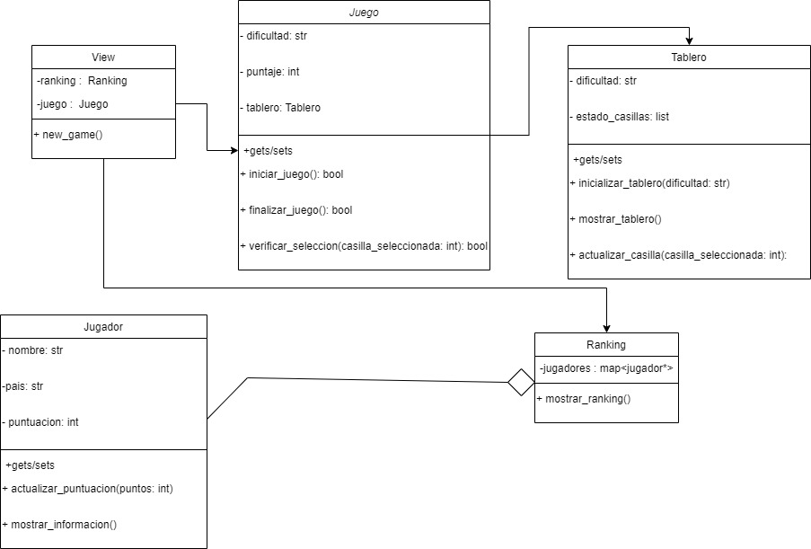

## Ayudas
A continuación verás algunos textos y preguntas que pueden ayudar en el proceso de identificación de las clases, métodos, atributos y relaciones para 
refactorizar el código del ejercicio

### Identificación de Clases Potenciales
Para identificar las clases, piensa en los "nombres sustantivos" que ves en la descripción del proyecto y en las funcionalidades que has observado:
- **Entidades Principales:** ¿Qué sustantivos se mencionan repetidamente? Ejemplo: en un juego, clases como `Jugador`, `Tablero`, `Juego` podrían ser centrales.
- **Grupos de Datos:** ¿Qué información se maneja conjuntamente? Esto podría indicar una clase. Por ejemplo, si se maneja nombre, puntaje, y nivel del jugador, una clase `Jugador` podría encapsular estos datos.
- **Agrupación lógica de funcionalidades**: Si partes del código siempre operan juntas o manejan la misma categoría de datos, probablemente deberían ser una clase. 
 - **Objetos y colecciones**
   - **Arreglos con Posiciones Específicas**
     - Si encuentras arreglos donde cada posición tiene un significado específico (por ejemplo, `datos[0]` siempre es el nombre, `datos[1]` es la dirección, etc.), es un indicativo claro de que esos datos podrían estar mejor representados como atributos de una clase. Acceder a los datos sería más legible y menos propenso a errores usando `objeto.nombre` y `objeto.direccion` en lugar de índices numéricos.

   - **Listas de Tuplas para Representar Objetos**
     - A menudo se utilizan listas de tuplas para representar una colección de objetos. Cada tupla contiene varios elementos relacionados, como por ejemplo, `(nombre, edad, salario)`. Este es un buen candidato para convertirse en una clase `Empleado`, donde cada instancia representa un empleado específico.

   - **Datos Agrupados que se Pasan Juntos**
     - Si pasas grupos de variables juntos a múltiples funciones, esto puede indicar que esos datos están estrechamente relacionados y serían más efectivos como una clase. Por ejemplo, si pasas información sobre un libro como título, autor y año a varias funciones, considera agruparlos en una clase `Libro`.
  
   - **Lógica Compleja que Manipula los Arreglos**
     - Si el código incluye manipulaciones complejas o repetidas de datos almacenados en arreglos o listas, encapsular esta lógica en métodos de una clase puede hacer el código más organizado, reusable y fácil de mantener.
   - **Extensión y Mantenimiento**
     - Si anticipas que los datos o las estructuras podrían expandirse en el futuro, usar clases hace que sea mucho más fácil añadir estas nuevas características sin perturbar el resto del sistema.

### Identificación de Métodos
Los métodos son acciones que las clases pueden realizar. Para definir métodos, busca "verbos" asociados con los sustantivos identificados:
- **Acciones Específicas:** ¿Qué acciones realiza cada entidad principal? Por ejemplo, un `Jugador` podría `incrementar_puntaje()`, `actualizar_nivel()`.
- **Funcionalidades del Sistema:** ¿Qué procesos y operaciones importantes necesita realizar el sistema? Ejemplo: `iniciar_juego()`, `verificar_seleccion()` en la clase `Juego`.
- Observa las tareas que se repiten en diferentes partes del código y que podrían ser centralizadas en un método de una clase
- **Funciones que operan sobre los mismos datos**: Cualquier función que modifique o utilice los mismos datos repetidamente es un candidato para ser un método de una clase. Por ejemplo, las funciones que modifican o leen el estado del juego (reset_board, update_score, check_game_end) podrían ser métodos de una clase Game.
- **Reutilización de código**: Si el mismo bloque de código se utiliza en múltiples funciones, considera convertirlo en un método dentro de una clase para mejorar la reutilización y la claridad

### Identificación de Atributos y Modificadores de Acceso
Los atributos son las características o propiedades de las clases, y los modificadores de acceso definen cómo se puede acceder a estos atributos:
- **Atributos:** Identifica qué información es fundamental para cada clase. Por ejemplo, la clase `Jugador` podría tener atributos como `nombre`, `puntaje`. 
- ¿Cuáles son los datos requeridos al momento de crear un objeto? estos a menudo se convierten en atributos de clase.
- **Modificadores de Acceso:** Decide quién necesita acceder a estos atributos. Utiliza `private` (privado) si solo la propia clase debe acceder a ellos. ¿Existen datos sensibles o críticos que deben ser protegidos de cambios externos?
- Variables compartidas entre funciones: Si varias funciones leen o modifican las mismas variables, esas variables son buenos candidatos para ser atributos de una clase. 
- Datos que definen el estado de un objeto: Cualquier dato que capture información sobre el estado de un sistema o de una entidad dentro de tu aplicación probablemente debería ser un atributo de una clase. Esto incluye configuraciones, contadores como puntajes o tiempos, y estados como el estado actual del juego.

#  Entregable - Mejoras para pasar a POO
Detalla en este markdown lo siguiente: 
- **Clases a Definir:** Enumera las clases que se podrían definir, describe sus propósito y justifica porque crees que es una clase útil para mejorar el programa.
- 1. **Juego**
   - **Propósito:** Representa el juego en sí mismo, incluyendo la lógica de juego y la gestión de la puntuación.
   - **Justificación:** Esta clase encapsularía toda la funcionalidad relacionada con el juego, lo que haría que el código sea más modular y fácil de entender.

2. **Tablero**
   - **Propósito:** Maneja la configuración y el estado del tablero de juego.
   - **Justificación:** Agruparía la información relacionada con el tablero y sus elementos, como las casillas y las imágenes mostradas en ellas.

3. **Jugador**
   - **Propósito:** Representa al jugador del juego, almacenando su nombre, país y puntuación.
   - **Justificación:** Encapsula los datos del jugador y proporciona métodos para actualizar su puntuación y mostrar su información en pantalla.

4. **Ranking**
   -  **Propósito:** Gestiona el ranking de puntajes de los jugadores.
   -  **Justificación:** Esta clase permite mantener un registro de los puntajes de los jugadores y proporciona métodos para actualizar y mostrar el ranking.

5.  **View**
   - **Propósito:** Representa la vista del juego, que incluye la interfaz de usuario y la interacción con el juego y el ranking.
   - **Justificación:** Agrupa la lógica relacionada con la presentación de la información del juego y el ranking, separándola de la lógica de negocio del juego mismo.
- **Métodos Importantes:** Enumera los métodos principales para cada clase. Incluye una descripción de cuál sería la utilidad de cada método
**Clase Juego:**
- `iniciar_juego()`: Inicia una nueva partida de acuerdo a la configuración de dificultad seleccionada.
- `verificar_seleccion(casilla_seleccionada)`: Verifica si la imagen seleccionada por el jugador coincide con la imagen objetivo.
- `finalizar_juego()`: Finaliza el juego cuando todas las imágenes han sido seleccionadas.

**Clase Tablero:**
- `inicializar_tablero(dificultad)`: Inicializa el tablero con un conjunto aleatorio de imágenes según la dificultad seleccionada.
- `mostrar_tablero()`: Muestra el tablero de juego actual en la interfaz de usuario.
- `actualizar_casilla()`: Actualiza el estado de una casilla después de que el jugador haya realizado una selección.

**Clase Jugador:**
- `actualizar_puntuacion(puntos)`: Actualiza la puntuación del jugador según los puntos obtenidos en una jugada.
- `mostrar_informacion()`: Muestra la información del jugador, incluyendo nombre, país y puntuación, en la interfaz de usuario.
**Clase View:**
- new_game(): Inicia un nuevo juego.
**Clase Ranking:**
- mostrar_ranking(): Muestra el ranking de puntajes de los jugadores en la interfaz de usuario.
- **Imagen del UML del diagrama de clases**  Adjunta una imagen del UML del diagrama de clases como una forma visual de planificar y entender la estructura de las clases, métodos, atributos y relaciones que podría tener una versión mejorada del código fuente.
 
- **organización de archivos:** Propon una estructura de organización de los archivos de este proyecto para que no queden todos en la raiz principal. Investiga cuáles podrían ser buenas formas de organizar los directorios y a partir de tu investigación indica qué directorios crearías y cómo los organizarías. 
- **src/:**
  - Este directorio contendría todo el código fuente del proyecto.
  
  - **juego/:**
    - Aquí se encontrarían los archivos relacionados con la lógica del juego.
      - juego.py: Clase principal que gestiona el juego.
      - tablero.py: Definición de la clase Tablero.
      - jugador.py: Definición de la clase Jugador.
      - ranking.py: Definición de la clase Ranking.
  
  - **vista/:**
    - Contendría los archivos relacionados con la interfaz de usuario.
      - view.py: Clase que maneja la vista y la interacción con el usuario.
  
  - main.py: Archivo principal que inicia la aplicación.
  
- **img/:**
  - Este directorio contendría todas las imágenes utilizadas en el proyecto, como emojis u otros elementos gráficos.
  
- requirements.txt: Archivo que lista todas las dependencias del proyecto para su fácil instalación.

Esta estructura separa claramente la lógica del juego de la interfaz de usuario y mantiene los archivos bien organizados para facilitar su mantenimiento y escalabilidad.
